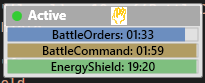
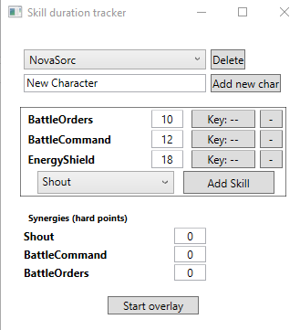
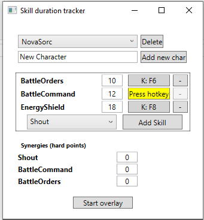
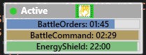

CtATracker

**CtATracker** is a lightweight overlay tool designed for action RPGs like *Diablo II*, where certain buffs (e.g. from the *Call to Arms* runeword) have a duration but no visible countdown. This shows an overlay with the remaining time on each buff.

## 🧩 Features

- Always-on-top overlay that shows remaining duration of buffs

  
- Customizable skill hotkey bindings
- Timer starts based on hotkey activation — no game hooking
- Simple, non-intrusive interface
- Will take buff from Battle command into account *if registered and active*!
- Store multiple characters
- Easy to extend with more spells

## 🎮 Setup
1) Start the program (.exe in `build`folder or build yourself)
2) Create a character and add skills from the drop down menu



3) set skill points: this is the total skill points, including all bonuses (not Battle commands buff itself!), i.e. the number the preview tells you.
4) [Optional] set synergy points if applicable
5) Click the hotkey listener button and press the corresponding hotkey. 
	- right now only keyboard buttons supported (no mouse)
	


6) Start the overlay & use your skills

- found a skill shrine? click the skill shrine button to add the +2 bonus (see limitations) 

- you can also add hotkeys for skills you don't cast yourself, e.g. a fade proc from treachery

## ❗ Limitations
- This tool does not hook directly into the game => no need to worry about 3rd party tool violations, but:
- It assumes you actually cast the spell
  - if you press the buttons faster than your FCR allows it will not notice
  - if you get iterrupted while casting, it will not notice
- It does not recognise when a game ends, but the timers will auto-update when you re-cast them in a new game (battle command buff might still apply, careful)
- You cannot rename a character, just delete and create a new one
- Once you listen to a hotkey input, either input it of press Escapce, if you add a new skill while listening you break the UI --> restart
- Skill shrine: the skill shrine duration depends on too many factors (curses, fade) to be estimated properly. In this tool, it will be active for **10s** before resetting.
- to avoid copyright issues, my skill shrine is hand drawn :P

## Extras
- Easy way to add your own skills
  - can easily be applied to other games than D2 if they have the same issue of buff times not showing
- Simply modify the `Skills.yml`file
  - Add any skill you like
```
- name: Blubberlutsch
  shortName: BL
  calculation: "13 + {blubber} * {lutsch}"
```
and it will show up in the gui.
