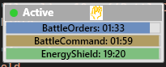
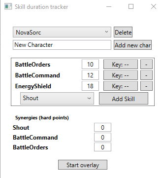
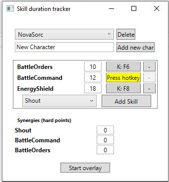
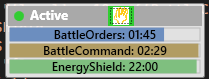

CtATracker

**CtATracker** is a lightweight overlay tool designed for action RPGs like *Diablo II*, where certain buffs (e.g. from the *Call to Arms* runeword) have a duration but no visible countdown. This shows an overlay with the remaining time on each buff.

## 🧩 Features

- Always-on-top overlay that shows remaining duration of buffs

  
- Customizable skill hotkey bindings
- Gamepad/controller support via XInput — bind skills to any controller button or trigger
- Control scheme toggle (Keyboard / Controller) per character, persisted in `Characters.yml`
- Timer starts based on hotkey or gamepad activation — no game hooking
- Simple, non-intrusive interface
- Takes Battle Command buff into account *if registered and active*
- Store multiple characters
- All tunable values (polling rate, timeouts, thresholds, colors) driven by `Config.yml`
- Easy to extend with more skills

## 🎮 Setup
1) Start the program (.exe in `build`folder or build yourself)
2) Create a character and add skills from the drop down menu



3) set skill points: this is the total skill points, including all bonuses (not Battle commands buff itself!), i.e. the number the preview tells you.
4) [Optional] set synergy hard points for each synergy skill — skills that have synergy relationships defined in `Skills.yml` will show them automatically
5) Click the hotkey listener button and press the corresponding hotkey or gamepad button.
   - In **Keyboard** mode: press the desired key to bind
   - In **Controller** mode: press the desired gamepad button (A/B/X/Y, shoulders, triggers, stick clicks, D-pad, Start/Back). A 3-second progress bar shows the capture window; press Esc to cancel.
   - Switch between modes via the radio buttons at the bottom of the main window
   


6) Start the overlay & use your skills

- found a skill shrine? click the skill shrine button to add the +2 bonus (see limitations) 
- Switching the control scheme (Keyboard / Controller) requires stopping and restarting the overlay.
- 
- you can also add hotkeys for skills you don't cast yourself, e.g. a fade proc from treachery

## ❗ Limitations
- This tool does not hook directly into the game => no need to worry about 3rd party tool violations, but:
- It assumes you actually cast the spell
  - if you press the buttons faster than your FCR allows it will assume you performed the cast
  - if you get interrupted while casting, it will still assume you performed the cast
- It does not recognise when a game ends, but the timers will auto-update when you re-cast them in a new game (battle command buff might still apply, careful)
- You cannot rename a character, just delete and create a new one
- Once you listen to a hotkey input, either input it of press Escapce, if you add a new skill while listening you break the UI --> restart
- Skill shrine: the skill shrine duration depends on too many factors (curses, fade) to be estimated properly. In this tool, it will be active for **10s** before resetting. (You can change that value in the Config.yml)
- to avoid copyright issues, my skill shrine is hand drawn :P

## Extras
- Easy way to add your own skills
  - can easily be applied to other games than D2 if they have the same issue of buff times not showing
- Since config files are auto-created, simply modify the `Skills.yml`file
  - Add any skill you like
```
- name: Blubberlutsch
  shortName: BL
  calculation: "20 + {level} * 10 + ({MySynergy1} + {MySynergy2}) * 7"
```
  - Expressions support full arithmetic (`+ - * /`), parentheses, `{level}` for the skill's own total points, and `{SynergyName}` to pull in other skills' levels
  - The formula engine (`NCalc`) handles complex multi-step calculations — see the built-in skills for real D2 examples
	- E.g for Wherewolf `calcuation: 40 + ({Lycantropy} > 0 ? {Lycantrophy}*20 + 20 : 0)`
  - Config.yml backs itself up to `.yml.bak` if it ever gets corrupted, so you won't lose your settings
